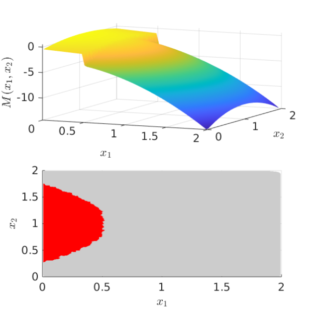

# AdaptiveMIVor
The Monte Carlo-intersite Voronoi (MiVor) adaptive scheme is an adaptive sampling technqiue for ordinary Kriging. 

The following library provides a Matlab implementation of the MiVor algorithm. For tests of the method three different test cases with different degrees of complexity are provided within this framework.

## Getting Started

We encourage those who are interested in using this code to run the main file and pick a test case.

### Prerequisites

Matlab version R2017a or higher.

## Examples 

The three following working examples similarly to what is found in the paper are included in this code for which the classification boundary limit is set to 0.0 for each case.

---

  
  
  

---

### Example 1
The following Gifs show an exemplary sampling process for example 1. 

 <kbd></kbd>
  <kbd></kbd>

### Adaptive sampling process Examples 2 and 3
The following Gifs show an exemplary sampling process for example 2 and 3 respectively. 

 <kbd></kbd>
  <kbd></kbd>

---

# References

Please cite this code with:

Fuhg, Jan N., and Amelie Fau. "An innovative adaptive kriging approach for efficient binary classification of mechanical problems." arXiv preprint arXiv:1907.01490 (2019).

